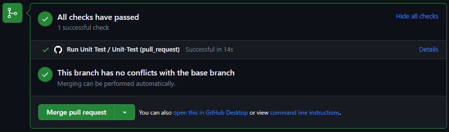
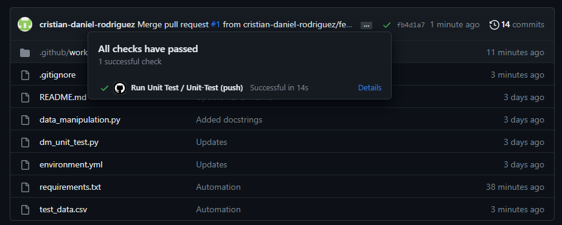
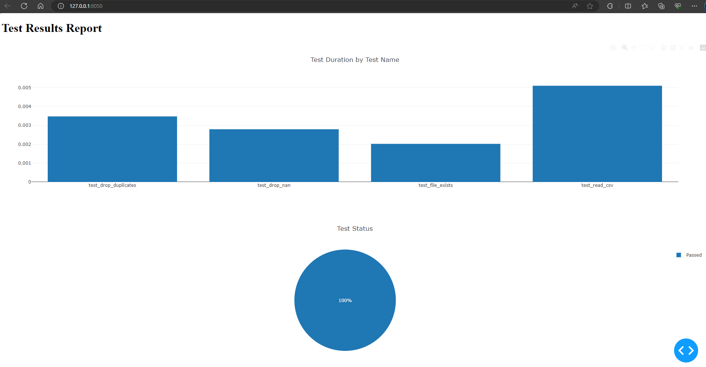

# Continuous Testing with GitHub Copilot

The code was created using GitHub Copilot to observe the capabilities of the tool and determine if it can be used for automated testing.

Acronyms: 
- GC = GitHub Copilot
- GCC = GitHub Copilot Chat

---

# Table of Contents

- [How to Setup](#how-to-setup)

- [Results Description](#results-description)
    - [Observations](#observations)
    - [Test Automation Results](#test-automation-results)
    - [Test Report Results](#test-report-results)

---

# How to Setup

1. Clone the repository
```
git clone https://github.com/cristian-daniel-rodriguez/continuous_testing_gc.git
```
2. Open an Anaconda prompt and navigate to the root of the repository
```
cd .\path\to\continuous_testing_gc
```
3. Install the ct_gc environment
```
conda env create -f environment.yml
```
4. Activate the Anaconda environment
```
conda activate ct_gc
```

---

# Results Description

## Observations
📄 General:
- GC can be used for doing Continuous Testing, however the GCC needs to be used for additional help
    - Mainly, the GCC is very helpful for automating the generation of tests and/or KPIs for each new pull request, push, and/or release
    In this use case, GitHub Actions was used for the automation
- GCC is capable of generating a basic test report dashboard 
- GCC is helpful for explaining code
    - The explanation of the selected code is well described, of course you will need some programming knowledge to understand
- GCC is really useful and quicker compared to searching on the internet

✅ Positive:
- Multiple CI framework options proposed for doing the automation tests
- If you make any modification in the automatically generated code, for the following automatic generations includes the change made manually by the user
- The solution can be extended for other uses like KPI evaluations
- GC propose some other related useful functions that can be added to the scripts
- The code documentation provided by GCC using docstrings is pretty good

❌ Negative
- Needs the GCC functionality
- Future questions to GCC had to be made in order to get the entire workflow running correctly
- The proposed functions from GC used libraries that have not been previously imported and it does not warn you


## Test Automation Results

Continuous testing with GitHub Actions with every pull request or merge into master branch




## Test Report Results
Unit testing results dashboard



---

